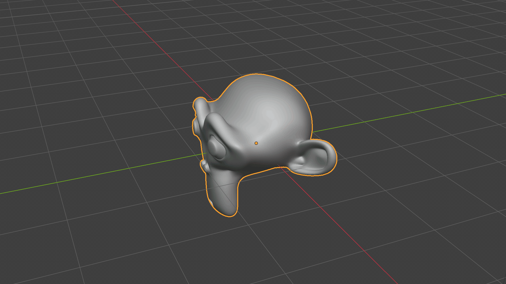
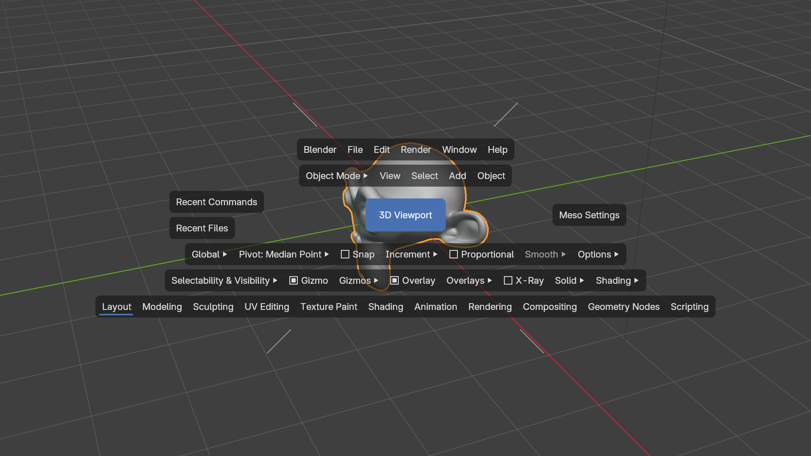
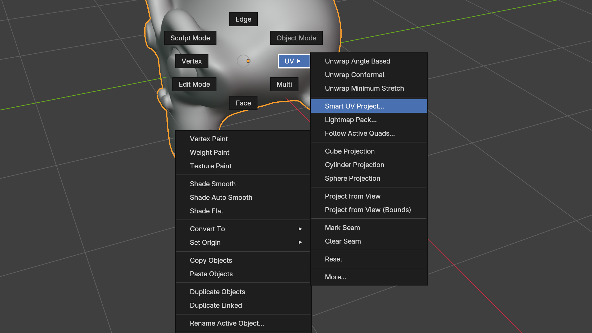

# Meso Mode for Blender

Hold <kbd>Space</kbd> anywhere in Blender 5.2 LTS for the **Plaza**: Blender's menus, tool
settings and workspaces in strips around the cursor. Press a mouse button around it for a
**Compass menu**, a radial menu you pick from with a flick, without looking.

## Why
After years of scaling Mayan pyramids, the muscle memory is just too strong ;)

Familiar workflows for artists coming from Autodesk Maya software. See
[`docs/comparison.md`](docs/comparison.md) for how the concepts map.

**Why "Meso"?** It stands for Mesoamerican. Long before anyone held Space to find a menu, the
peoples of Mesoamerica (the Olmec, the Maya, the Zapotec, the Mexica, better known as the
Aztecs, and many more) were charting the sky, keeping calendars that meshed like gears,
counting with a zero, raising cities of stone and giving the world chocolate. Their descendants
are still here, and Mayan, Zapotec and Nahuatl languages are spoken today.

Meso Mode builds nothing half as grand. Like every tool, it stands on the shoulders of giants:
Blender, its community, and decades of other people's good ideas about where a menu should go.
The pyramids are theirs; the menus are ours.

## What it does
- **The Plaza:** hold Space for menus that stay open while you browse, a Tool Settings row,
  modes, recent commands and files, and workspaces.
- **Tap Space for quad view:** in the 3D Viewport a quick tap of Space switches the single view
  to the four-view layout; tap over the Top, Front or Side view to maximize it, over the
  perspective view to go back. Elsewhere a tap keeps Blender's own Space action.
- **Compass menus:** press in a zone around the Plaza for a radial menu (views, area layout,
  editors, selection, toggles). Any Blender menu or pie can go in any of the 15 slots.
- **Right-click Compass** (with the Meso Keymap): hold right-click for the modes, Shift+right-click
  for the mode's tools. A quick click keeps Blender's own action.
- **The Meso Keymap** (optional): Blender's Industry Compatible keymap plus isolate on Ctrl 1,
  snapping while you hold X / C / V / J, origin editing on D, and more.
- **Nothing native is removed:** every Meso key can be switched off, and every native action it
  displaces stays reachable.

  
  

Read the [user guide](docs/guide.md) and the [keymap](docs/keymap.md).

## Getting it
Meso Mode is free and open source. If someone charged you for it, you paid for something
that's free. Get it either way:

- **The release:** download `meso-<version>.zip` from the
  [latest release](https://github.com/anoxdetox/meso/releases/latest).
- **The Blender Extensions platform:** Meso Mode is in its
  [approval queue](https://extensions.blender.org/approval-queue/meso/). Download it there,
  and leave a review while you're at it.

Or build it yourself. You need Blender 5.2 and GNU make with bash (Linux, macOS). In a
clone of this repository, run `make build`. It writes `dist/meso-<version>.zip`. `make` runs the
`blender` it finds on your PATH; the Linux tarball, the macOS app and the Windows installer do
not put it there, so name the binary: `make build B=/path/to/blender` (on macOS
`B=/Applications/Blender.app/Contents/MacOS/Blender`), or put that `B=` line in an untracked
`local.env` file at the root of the clone.

Without make (Windows cmd or PowerShell too), run Blender's own build command in the clone,
with the full path to Blender if it is not on your PATH:
`blender --command extension build --source-dir src/meso --output-dir dist`.

To install the zip, open Blender's Preferences ▸ Get Extensions, open the menu at the top
right and choose **Install from Disk…**. Pick the zip, then make sure Meso Mode is ticked in
Preferences ▸ Add-ons. Dragging the zip into Blender's window works too.

When it is first enabled, Meso Mode asks whether to use the [Meso Keymap](docs/keymap.md).
**Keep My Keymap** changes nothing, and you can change your mind later in its preferences.

Developed and tested on Linux; meant to run on Windows and macOS too (not tested there yet).
The test suite was written for Linux on KDE Plasma, and it is always open to anyone who wants
to take it to other test beds: [`CONTRIBUTING.md`](CONTRIBUTING.md) covers testing and helping
out.

> **Disclaimer:** This is 100% vibe coded. We're not responsible if this code eats your homework.
> It comes WITHOUT ANY WARRANTY (see `LICENSE`, GPL-3.0 §§15–16).

## License
Code (`src/meso/`): **GPL-3.0-or-later** (`LICENSE`). Documentation and media: **CC-BY-SA-4.0**.
Per-file licensing follows [REUSE](https://reuse.software/) (`REUSE.toml`, `LICENSES/`).

---
Meso Mode is an independent, free project. Not affiliated with, endorsed or sponsored by
Autodesk, Inc. Autodesk and Maya are registered trademarks or trademarks of Autodesk, Inc.,
and/or its subsidiaries and/or affiliates in the USA and/or other countries. Blender is a
trademark of the Blender Foundation; Meso Mode is not affiliated with the Blender Foundation.
