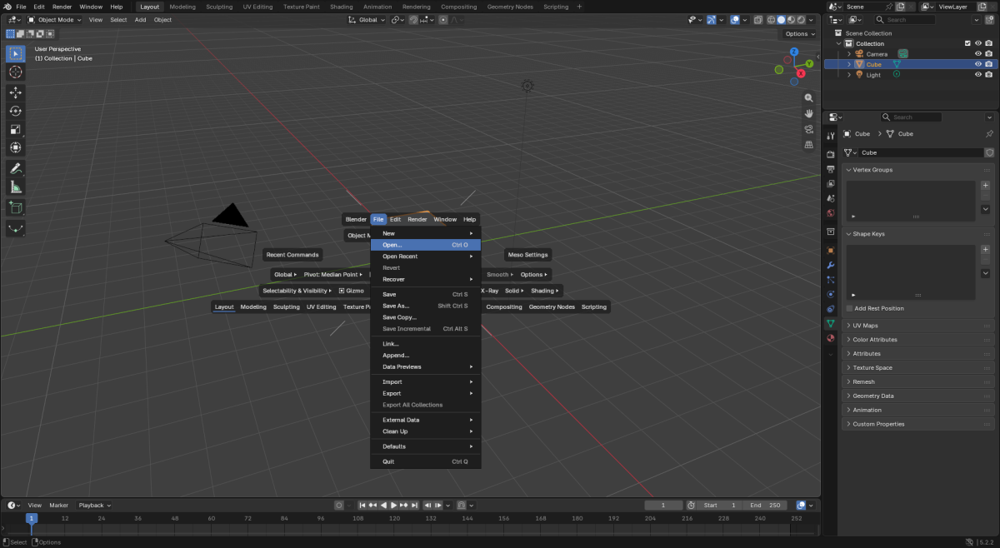
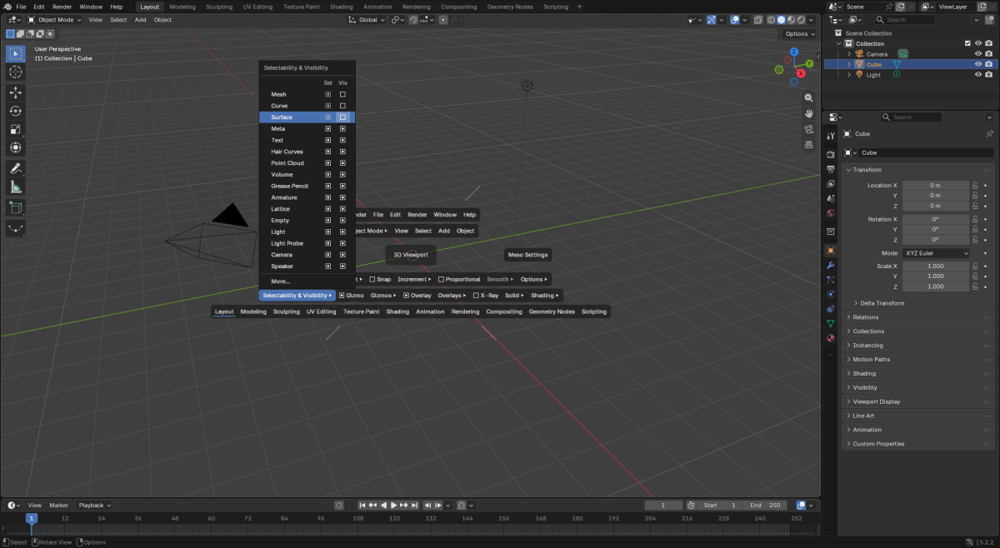
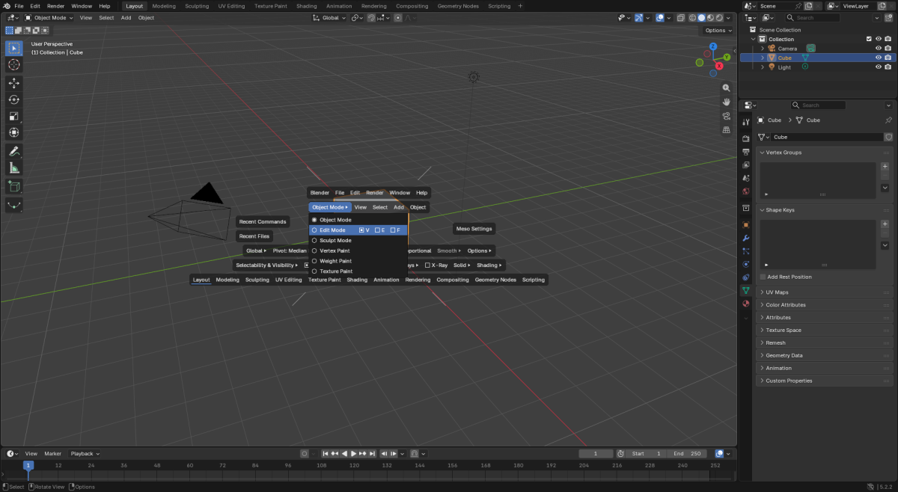
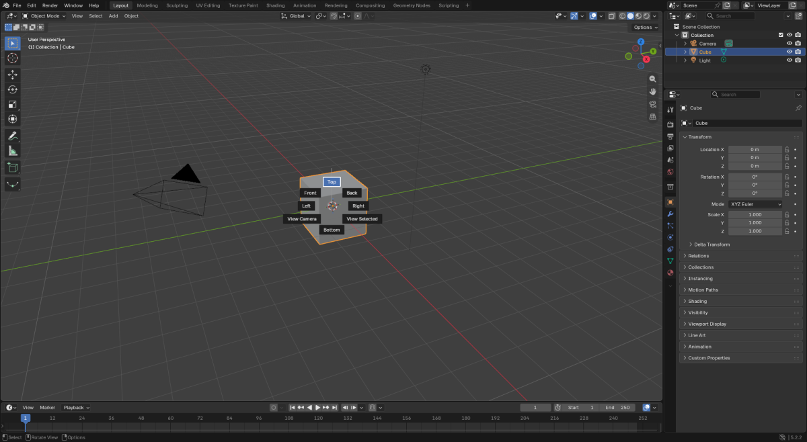
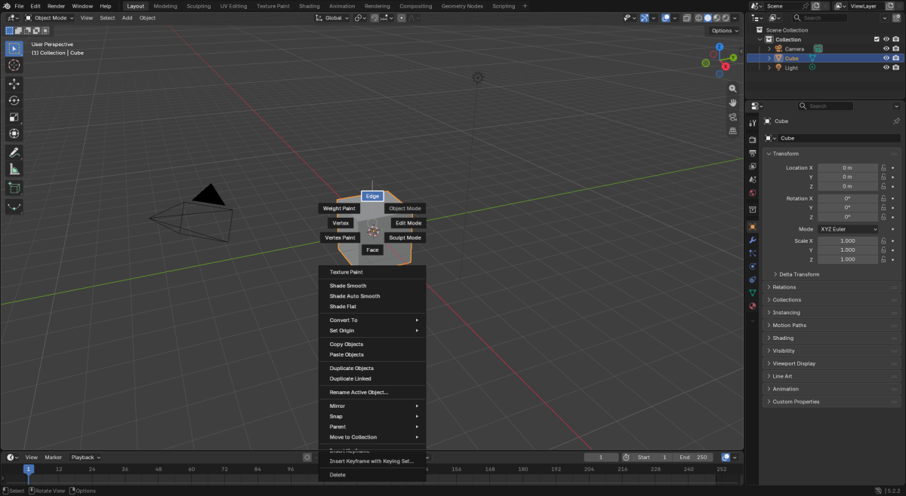
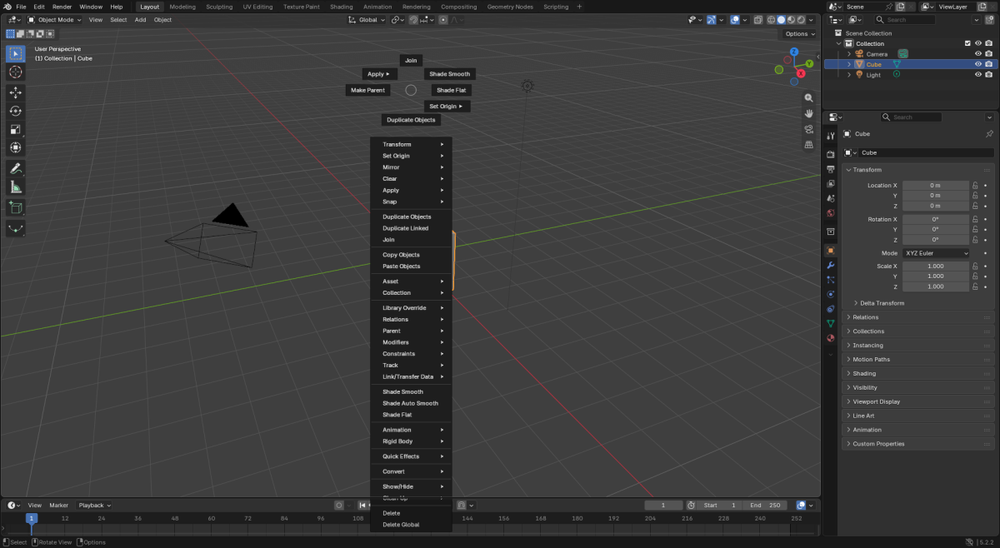

# Meso Mode user guide

Meso Mode adds two things to Blender 5.2 LTS: the **Plaza**, menus around the cursor while you
hold Space, and **Compass menus**, radial menus you pick from with a flick of the mouse. The
optional [Meso Keymap](keymap.md) adds a few keys on top of Blender's Industry Compatible keymap.

## The Plaza (hold Space)

Hold <kbd>Space</kbd> anywhere and the Plaza opens at the cursor. Its strips hold the top-bar
menus, the hovered editor's header menus, a Tool Settings row (orientation, pivot, snapping,
proportional editing and display toggles), recent commands, recent files and the workspaces.
Releasing Space closes everything.

### Menus stay open while you browse
Rest on a menu to open it, click to pin it, and move to the next label to switch. A label you
only cross on your way into the open menu doesn't steal it: stop on that label (or click it) to
switch.

Once the pointer has been inside an open menu or submenu (or you clicked the menu), it stays
open when the pointer wanders onto the viewport or empty space, even when the way out crosses
other menu labels. It closes when you pick an item, click empty space, click its title, or press
Esc.

To switch to another menu, slide along the menu's own row, or stop on (or click) another label;
the menu you switch to stays open too. A menu that opened on hover and was never entered still
closes shortly after the pointer leaves it.

The **Meso Settings** box on the centre line opens the add-on preferences.

### Dropdowns work like Blender's
The dropdowns are drawn from Blender's own menus and popovers, and follow Blender's click
conventions: Shift+click adds to a multi-choice set, and Ctrl+click expands the select mode.
Anything that can't be reproduced hands off to the native menu.

In Selectability & Visibility, clicking a type's name (Mesh, Empty, Text…) toggles its
visibility, like its Vis box.

Press a check box and drag across the ones below or above it to set them all the same way, as
in Blender (in Selectability & Visibility the drag stays in its column). The whole drag is one
undo step.

### Switch modes inside the Plaza

In the 3D Viewport the first label of the header row (Object Mode, Edit Mode, ...) opens the
same mode list as Blender's header menu, for the active object's type, with the current mode
checked. Pick a mode and the Plaza stays open, its menus and tool settings already those of the
new mode.

A mode that has select modes is one row with a button for each: **Edit Mode [V] [E] [F]** for a
mesh (Point, Stroke, Segment for Grease Pencil; Point, Curve for hair curves, also in Sculpt
Mode; Path, Point, Tip in Particle Edit). The current select modes are checked: boxes for the
mesh select modes, which combine, radios for the others, which pick one.

Click **Edit Mode** to enter the mode as it is. Click **V** to go straight to vertex select Edit
Mode from any mode (the two undo steps of the header's mode menu then its button, so undo gives
the old select mode back). In the mode a button only changes the select mode, like the header
buttons, and the list stays open.

The mesh buttons follow the header's Vertex / Edge / Face buttons (a click picks one,
Shift+click adds or removes one, Ctrl+click expands or contracts the selection); the others pick
one. Left / Right move between the mode and its buttons.

### Recent files
The **Recent Files** box on the centre line (under Recent Commands), and File ▸ Open Recent,
list Blender's recent files as its Open Recent menu does, with More... and Clear Recent Files
List.... Picking one closes the Plaza and opens the file; Blender asks about unsaved changes as
usual.

### Tap Space
In the 3D Viewport a tap toggles quad view, or maximizes the hovered Top/Front/Side view.
Elsewhere a tap keeps Blender's own Space action (play, tools or search).

### What the Plaza shows, and where
The preferences choose a **Style**: *Full* (everything above), *Zones Only* (just the centre box
and the zone ticks, with every Compass menu) or *Centre Only* (the centre box alone; only its
own Compass opens). With *Full*, each row and side box can be hidden on its own (the centre box
and Meso Settings always show). **Position** opens the Plaza at the mouse, at the centre of the
editor under the mouse, or at the centre of the window; **Draw Over** keeps it inside the
hovered editor instead of the whole window. **Open the Plaza over** switches it off for chosen
editors: there Space does what it does in Blender (in the Timeline, for instance, it plays).

## Compass menus

While the Plaza is open, press the left, middle or right mouse button in a zone (the four
quarters split by the corner ticks, or the centre box) and that zone's Compass opens at the
pointer: up to eight boxes around a small ring, and a list under them. The Plaza steps aside
while the Compass is open.

The direction picks: a short flick toward a box is enough, without looking, and it doesn't
matter how far you go or whether you end on the box. Even a flick that ends on the list picks
the box in that direction, and so does a slow stroke across it. To pick from the list, hold
the pointer still on it for a moment, then move to the item and let go. A flick toward a
greyed-out box picks nothing. Let go in the ring to cancel. A quick middle or right click
leaves the Compass open; then click a box or a list item. A left click on empty space still
just closes an open menu.

A list too long for the window shows arrows at its ends. Turn the mouse wheel or swipe the
trackpad over the list, or hold still on an arrow, to scroll it. Scrolling never picks
anything.

The defaults, all with the left button:

| Zone | Compass |
|---|---|
| North | The area: maximize, full screen, quad view, split, new window |
| South | Change this editor |
| West | Select: all, none, invert, the edit select modes, the mode's Select menu |
| East | The toolbar, sidebar, header, overlays, gizmos, X-ray and other toggles |
| Centre | The view: Top, Front, Camera… (the editor's View pie) |
| East, right button | The Tool Settings (orientation, pivot, snapping, proportional editing) |
| Centre, right button | The workspaces |
| Centre, middle button | The Plaza's options and Meso Settings |

Each of the 15 zone and button slots can hold any Blender menu or pie menu (a pie's items land
in their pie directions) or a built-in Compass (`meso:layout`, `meso:editors`, `meso:select`,
`meso:toggles`, `meso:tool_settings`, `meso:views`, `meso:settings`, `meso:workspaces`). Set
them in the add-on preferences, under Compass menus.

## Right-click Compass menus (Meso Keymap)

With the Meso Keymap, hold or drag the right mouse button in the 3D View for a Compass of the
modes, with the context menu as the list under it. A quick click still opens the context menu
as before.

For a mesh: Edge north, Vertex west, Face south, Object Mode north-east, **UV ▸** east (Blender's
UV unwrap menu; from Object Mode it enters Edit Mode first), **Multi** south-east (vertex, edge and face select together), Edit Mode
south-west (with the current select mode) and Sculpt Mode north-west. The paint modes head the
list. For other objects: Object Mode north-east, Edit Mode east, the select modes where the
object has them, and the other modes on the diagonals. In Edit Mode the select modes stay
available, as the header buttons are; only the mode you are in is greyed out.

Right-click, flick, done: the Compass doesn't have to draw first. A flick north-east is Object
Mode, a flick south is Face. Hold still on the list for a moment to pick a context menu item
instead.

The Compass stays where you pressed, even at the edge of the window (its list moves above or
beside it and scrolls when it is long), and the pointer is never moved. The press point counts:
in Object Mode the Compass is for the object under the press, so it offers that object's modes
(right-click an empty or a camera and there is only Object Mode), and picking a mode first
selects that object, as a click there would, then switches its mode. So right-click a mesh,
flick south, and you are editing its faces, whichever object was active. Nothing under the
press: the active object's modes, and the selection stays. If the mode change cannot run, the
selection change is its own undo step. The context menu items act on the selection as before,
and in Edit Mode the press selects nothing.

Hold <kbd>Shift</kbd> and the right mouse button for the mode's tools (Object, Vertex, Edge or
Face: Join, Shade Smooth, Loop Cut, Bevel, Inset, Knife…), with the mode's menu as the list. A
quick Shift+right click still places the 3D cursor.

The 3D cursor (click to place, drag to move) is on <kbd>Ctrl</kbd> <kbd>Shift</kbd> right click.
The "Shift Right Click" preference puts it back on Shift right click, and the tool Compass then
moves to Ctrl Shift right click.

## Preferences
Everything is in Preferences ▸ Add-ons ▸ Meso Mode (or the Plaza's **Meso Settings** box): the
tap time and action, transparency, sizes and colours, which rows show, the menus' timing, the
Compass slots, and the Plaza's keys, grouped like Blender's keymap editor. The Meso Keymap's
keys are edited in Blender's own keymap editor; see [the keymap page](keymap.md).

## Nothing native is removed
Every binding can be edited or switched off: the Plaza's in the add-on preferences, the Meso
Keymap's in Blender's own keymap editor. Every native action a Meso key displaces stays
reachable, and switching the Meso item off gives the key back.
